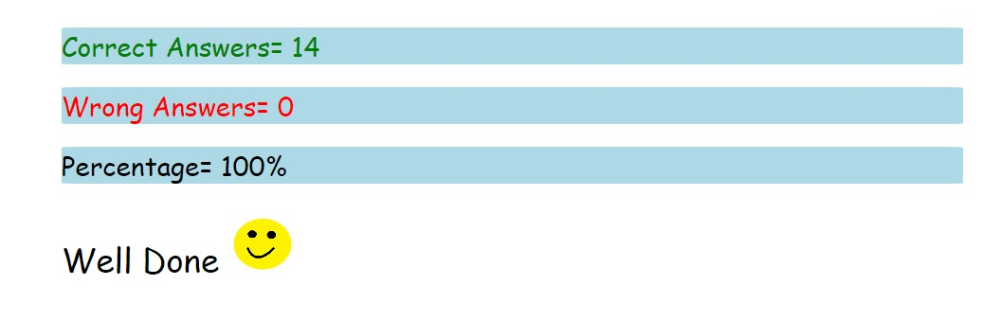

# 01 Assignment

1.	Who is the founder of JavaScript and when?
    
    Brendan Eich , 1995

2.	What was the first browser, and when was it released?

    World Wide Web , 1990

3.	Name the two dominant browsers in 2000.
    
    - Netscape navigator
    - Internet explorer

4.	What is ECMAScript?

   -  European computer manufacturers association

    ECMAScript is an institution that makes standards for scripting languages

5.	Define syntax.

    A set of rules that has to be followed while writing code

6.	What is TC39?

    It is a technical committee under ECMAScript international that standardize javascripting languages

7.	Name different data types in JavaScript

   - Primitive data type
   - Non primitive data type

   ## Primitive 
      - string
      - number
      - boolean
      - null
      - undefined
      - symbols
      - NAN
   ## Non primitive

      - Array  
      - Object

8.	Explain primitive and non-primitive data types

   - primitive data type

    The predefined data types provided by JavaScript language are known as primitive data types. Primitive data types are also known as in-built data.

    - Non primitive data type

    it is derived from the primitive data type

9.	Differentiate null and undefined

    - null:- Intentional absence of a value

    - undefined:- Value not assigned

    
    
  